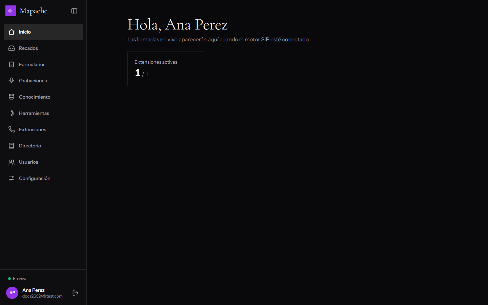
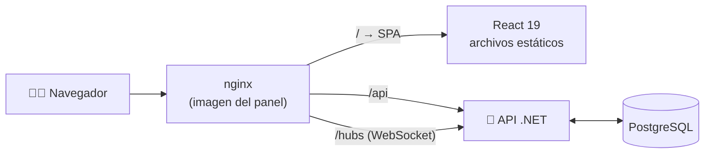
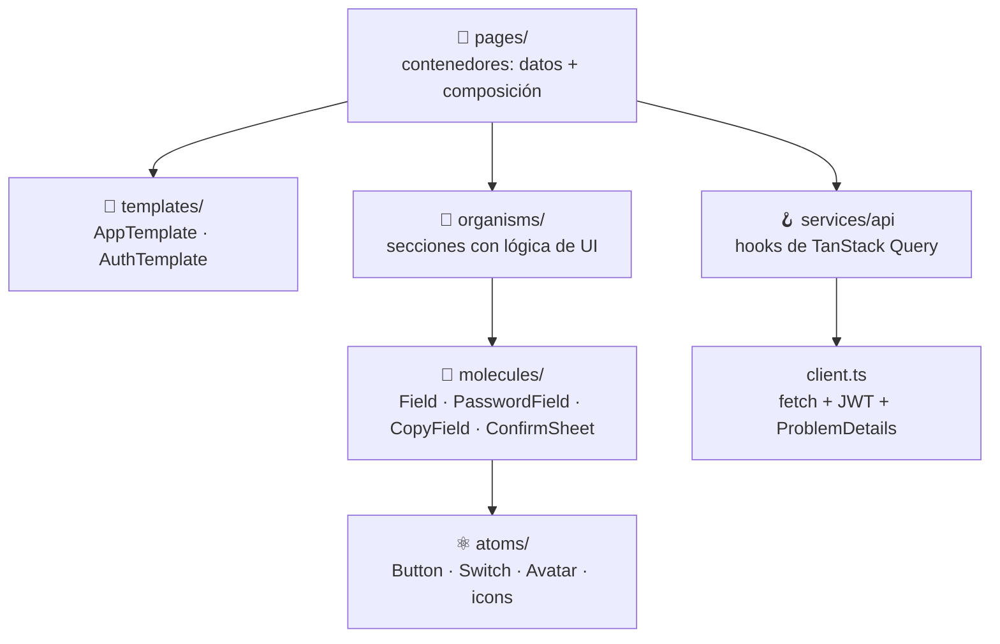

<div align="center">

# 🦝 Wan — Panel

**El panel web del bot telefónico con IA.**
Configura extensiones SIP, el modelo de IA y la voz, y revisa en vivo las llamadas, los recados y los formularios.

[](LICENSE)
[](https://react.dev/)
[](https://www.typescriptlang.org/)
[](https://vite.dev/)
[](https://tailwindcss.com/)
[](https://tanstack.com/query)
[](#-docker)
[](#-contribuir)

[Documentación](docs/README.md) · [Guía de uso](docs/guia-de-uso.md) · [Arquitectura](docs/arquitectura.md) · [API (backend)](../backend/README.md)

<br />


</div>

---

## ✨ Qué incluye

| | |
|---|---|
| ☎️ **Extensiones** | Cuentas SIP con todas las opciones de un softphone: servidor secundario, proxy, transporte, NAT, códecs. El motor las registra al guardar. |
| 🧠 **IA y voz** | Proveedor (OpenAI, Gemini o Claude), modelo, API keys e instrucciones del bot; conexión con el agente de ElevenLabs. |
| 📒 **Directorio** | A quién transfiere el bot y cuándo. |
| 📋 **Formularios** | Editor de campos, creación con IA, respuestas y acciones: webhook, Teams, Google Chat, Slack y correo. |
| ✉️ **Recados** | Los mensajes que toma el bot, con estados y avisos en vivo. |
| 🎙️ **Grabaciones** | Reproductor de las llamadas grabadas. |
| 📚 **Conocimiento** | Bases con documentos que el bot usa para responder, con buscador de prueba. |
| 🔌 **Herramientas** | Peticiones HTTP a tus sistemas y servidores MCP. |
| 🤖 **Acceso MCP** | Tokens con permisos por herramienta (toggles) y guía para Claude Code, Cursor y Claude Desktop. |
| 👥 **Usuarios** | Alta, roles (Administrador / Operador), contraseñas. |
| 🌗 **Tema** | Claro, oscuro o el del sistema. |
| 📱 **Mobile first** | Barra inferior en el teléfono y sidebar colapsable en escritorio. |

## 📸 Capturas

<table>
  <tr>
    <td width="50%"><p align="center"><b>Extensiones</b>: cuentas SIP</p></td>
    <td width="50%"><p align="center"><b>Herramientas</b>: HTTP y MCP</p></td>
  </tr>
  <tr>
    <td width="50%"><p align="center"><b>Configuración</b>: llamadas, IA, voz y MCP</p></td>
    <td width="50%"><p align="center"><b>Tema oscuro</b></p></td>
  </tr>
</table>

<p align="center">
  
  <br /><sub>En el teléfono: navegación con el pulgar</sub>
</p>

## 🏗️ Cómo encaja



El panel y la API comparten origen gracias a nginx: no hay CORS y el JWT nunca cruza dominios.

## 🚀 Inicio rápido

```bash
npm install
cp .env.example .env     # API_PROXY_TARGET, por defecto http://localhost:5238
npm run dev              # http://localhost:5173
```

La API tiene que estar corriendo (ver el [README del backend](../backend/README.md)). Para levantar todo junto con Docker, desde la raíz del monorepo:

```bash
docker compose up -d --build   # http://localhost:8080
```

| Comando | Qué hace |
|---------|----------|
| `npm run dev` | Servidor de desarrollo con HMR y proxy a la API |
| `npm run build` | Chequeo de tipos y build de producción en `dist/` |
| `npm run preview` | Sirve el build localmente |
| `npm run lint` | Oxlint |

## 🧩 Arquitectura: Atomic Design + SOLID



- Las **páginas** son contenedores: obtienen datos con hooks y los pasan a los organismos.
- Los **organismos** son presentacionales: reciben datos y callbacks por props, no llaman a la API (inversión de dependencias).
- Todas las **alertas** salen de un solo lugar: cada mutación declara su mensaje en `meta` y [react-hot-toast](https://react-hot-toast.com/) lo muestra.

Detalle en [docs/arquitectura.md](docs/arquitectura.md).

```
src/
├── app/              # App, rutas, guarda de sesión, QueryClient
├── components/
│   ├── atoms/        # Button, Switch, Avatar, Logo, icons, Toaster
│   ├── molecules/    # Field, PasswordField, CopyField, ConfirmSheet, ThemeToggle...
│   ├── organisms/    # PageHeader, FormSection, settings/, tools/, forms/, users/...
│   └── templates/    # AppTemplate (sidebar), AuthTemplate (login)
├── hooks/            # useAuth, useRealtime, useSidebarCollapsed
├── lib/              # format, theme
├── pages/            # Una por ruta
├── services/api/     # Cliente HTTP y hooks por dominio
└── stores/           # Sesión (authStore)
```

## 🛠️ Stack

| Área | Tecnología |
|------|------------|
| UI | React 19 · TypeScript |
| Build | Vite 8 · Oxlint |
| Estilos | Tailwind CSS v4 · Instrument Sans + Cormorant Garamond (Fontsource) · estilo de [savegresoft.com](https://savegresoft.com) en violeta |
| Animación | Motion |
| Datos | TanStack Query 5 |
| Rutas | React Router 8 |
| Tiempo real | SignalR (`@microsoft/signalr`) |
| Alertas | react-hot-toast |
| Íconos | [Lucide](https://lucide.dev) (`lucide-react`) |
| Servidor | nginx (imagen Docker) |

## 📖 Documentación

| Guía | Contenido |
|------|-----------|
| [Guía de uso](docs/guia-de-uso.md) | Cada pantalla del panel, paso a paso |
| [Arquitectura](docs/arquitectura.md) | Atomic design, SOLID, carpetas y rutas |
| [Datos y API](docs/datos.md) | Cliente HTTP, hooks, claves de caché, errores y toasts |
| [Tiempo real](docs/tiempo-real.md) | SignalR y cómo se refrescan los datos |
| [Estilos](docs/estilos.md) | Tailwind, tema claro/oscuro, mobile first, Motion |
| [Desarrollo](docs/desarrollo.md) | Comandos, variables y cómo agregar una pantalla |
| [Despliegue](docs/despliegue.md) | Imagen Docker, nginx y GitHub Actions |

## 🐳 Docker

El workflow de [GitHub Actions](.github/workflows/docker.yml) corre lint y build y publica la imagen multi-arquitectura (`linux/amd64`, `linux/arm64`):

| Evento | Tags |
|--------|------|
| push a `main` | `main`, `sha-<commit>` |
| tag `v1.2.3` | `1.2.3`, `1.2`, `1`, `latest` |
| pull request | se compila, no se publica |

La imagen se publica en `ghcr.io/<usuario>/wan-web`, y en Docker Hub si el repositorio tiene los secretos `DOCKERHUB_USERNAME` y `DOCKERHUB_TOKEN`. nginx hace proxy a `http://api:8080`, así que el servicio de la API debe llamarse `api`.

## 🤝 Contribuir

Wan es **open source**. Los issues y pull requests son bienvenidos:

1. Haz un fork y crea una rama.
2. Respeta atomic design, mobile first y el tema oscuro ([docs/desarrollo.md](docs/desarrollo.md)).
3. Deja `npm run lint` y `npm run build` sin errores.
4. Abre el pull request con capturas si cambia la UI.

## 📄 Licencia

[MIT](LICENSE) © 2026 **Steven Gazo Maliaño**
