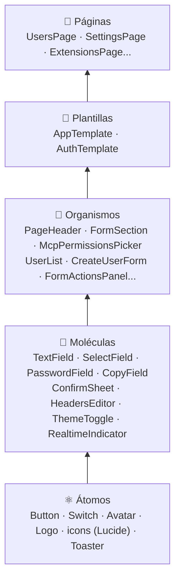

# 🧩 Arquitectura

## Atomic Design

La UI se arma de piezas chicas a grandes. Cada nivel solo usa los niveles de abajo.



| Nivel | Carpeta | Regla | Ejemplo |
|-------|---------|-------|---------|
| Átomos | `components/atoms/` | Sin estado de negocio ni datos. Un solo elemento. | `Button` con variantes y `loading` |
| Moléculas | `components/molecules/` | Combinan átomos para una tarea chica. | `PasswordField` = campo + botón de mostrar |
| Organismos | `components/organisms/<dominio>/` | Secciones completas, **presentacionales**: datos y callbacks por props. | `UserList` recibe `users` y `onDelete` |
| Plantillas | `components/templates/` | La estructura de la pantalla, sin contenido. | `AppTemplate`: sidebar, barra inferior y `<Outlet />` |
| Páginas | `pages/` | **Contenedores**: llaman a los hooks de datos y componen organismos. | `UsersPage` |

## SOLID en React

| Principio | Cómo se aplica |
|-----------|----------------|
| **S**: responsabilidad única | Una página orquesta, un organismo muestra, un hook trae datos, `client.ts` habla HTTP. `roleLabels.ts` solo nombra roles. |
| **O**: abierto/cerrado | Los componentes se extienden por props (`variant`, `size`, `action`) sin tocar su código. Las alertas se agregan con `meta` en cada mutación, sin tocar el `QueryClient`. |
| **L**: sustitución | Los campos reenvían las props nativas (`...props`): un `TextField` sirve donde serviría un `<input>`. |
| **I**: segregación de interfaces | Cada organismo pide solo lo que usa: `UserList` recibe callbacks, no los objetos de mutación. |
| **D**: inversión de dependencias | Los organismos no importan `services/api`: dependen de props. La página decide de dónde salen los datos, y el organismo se puede probar o reutilizar con datos falsos. |

### Ejemplo: contenedor y presentacional

```tsx
// pages/UsersPage.tsx: contenedor
export function UsersPage() {
  const { data: users } = useUsers()
  const update = useUpdateUser()
  const [deleting, setDeleting] = useState<UserListItem | null>(null)

  return (
    <UserList
      users={users ?? []}
      onChangeRole={(user, role) => update.mutate({ id: user.id, displayName: user.displayName, role })}
      onDelete={setDeleting}
      /* ... */
    />
  )
}

// components/organisms/users/UserList.tsx: presentacional, sin API
export function UserList({ users, onChangeRole, onDelete }: UserListProps) { /* ... */ }
```

> Algunas páginas anteriores a esta estructura (extensiones, formularios) todavía hacen más de lo que deberían. Se están separando en organismos poco a poco; el código nuevo sigue el patrón de arriba.

## Carpetas

```
src/
├── main.tsx                 # Monta la app, fuentes y tema
├── index.css                # Tailwind v4: @theme, variante dark
├── app/
│   ├── App.tsx              # Rutas (carga diferida con lazy)
│   ├── RequireAuth.tsx      # Guarda de sesión y de rol admin
│   └── queryClient.ts       # TanStack Query + toasts globales
├── components/
│   ├── atoms/  molecules/  organisms/  templates/
├── hooks/
│   ├── useAuth.ts           # Sesión actual, login, logout
│   ├── useRealtime.ts       # Conexión SignalR
│   └── useSidebarCollapsed.ts
├── lib/
│   ├── format.ts            # Fechas, duraciones, tamaños
│   └── theme.ts             # Preferencia claro/oscuro/sistema
├── pages/                   # Una por ruta
├── services/api/            # Un archivo por dominio + client.ts + keys.ts
└── stores/authStore.ts      # Sesión en localStorage
```

## Rutas

| Ruta | Página | Acceso |
|------|--------|--------|
| `/login`, `/registro` | `LoginPage`, `RegisterPage` | anónimo |
| `/` | `DashboardPage` | usuario |
| `/recados` | `MessagesPage` | usuario |
| `/formularios`, `/formularios/:id` | `FormsPage`, `FormDetailPage` | usuario |
| `/formularios/nuevo`, `/formularios/:id/editar` | `FormEditorPage` | admin |
| `/grabaciones` | `RecordingsPage` | usuario |
| `/conocimiento`, `/conocimiento/:id` | `KnowledgePage`, `KnowledgeBasePage` | usuario |
| `/herramientas` | `ToolsPage` | admin |
| `/extensiones` | `ExtensionsPage` | usuario |
| `/extensiones/nueva`, `/extensiones/:id` | `ExtensionFormPage` | admin |
| `/directorio` | `DirectoryPage` | usuario |
| `/directorio/nueva`, `/directorio/:id` | `DirectoryFormPage` | admin |
| `/usuarios` | `UsersPage` | admin |
| `/perfil` | `ProfilePage` | usuario |
| `/configuracion` | `SettingsPage` | admin |

`RequireAuth` redirige al login sin sesión y a `/` si la ruta es `admin` y el usuario no lo es. El sidebar oculta los ítems `admin: true` a los operadores. La guarda del panel es de conveniencia: **la API vuelve a validar el rol en cada request**.

Las páginas se cargan con `lazy()`: el login no descarga SignalR ni el resto del panel.
