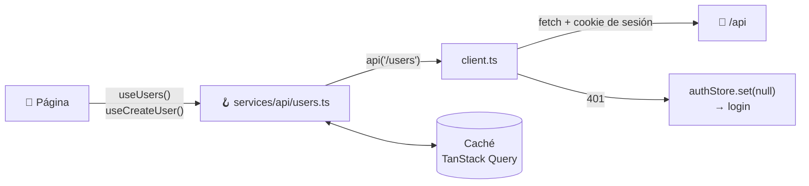
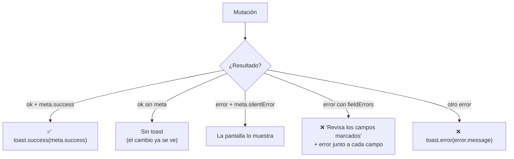

# 🔄 Datos y API

## Capas



## Cliente HTTP (`services/api/client.ts`)

`api<T>(path, { method, body })`:

- Antepone `/api` y agrega el header `X-Wan-Client: 1` (anti-CSRF). La sesión va sola en la cookie HttpOnly `wan_session`.
- Serializa el body a JSON; un `FormData` se envía tal cual (multipart).
- **401 con sesión:** cierra la sesión y `RequireAuth` lleva al login.
- **Errores:** lanza `ApiError` con `status`, `message` (el `title` del ProblemDetails) y `fieldErrors` por campo en camelCase.
- **Sin red:** `ApiError(0, 'No se pudo conectar con el servidor')`.
- **204:** devuelve `undefined`.

## Hooks por dominio

Un archivo por dominio en `services/api/` (`extensions.ts`, `forms.ts`, `users.ts`...), todos reexportados en `index.ts`:

```ts
export function useUsers() {
  return useQuery({ queryKey: keys.users, queryFn: () => api<UserListItem[]>('/users') })
}

export function useCreateUser() {
  const queryClient = useQueryClient()
  return useMutation({
    mutationFn: (input: CreateUserInput) => api<UserListItem>('/users', { method: 'POST', body: input }),
    onSuccess: () => queryClient.invalidateQueries({ queryKey: keys.users }),
    meta: { success: 'Usuario creado' },
  })
}
```

Los tipos de los DTOs viven junto a sus hooks, con los mismos nombres de propiedades que la API.

## Claves de caché (`services/api/keys.ts`)

Todas las claves en un solo lugar, jerárquicas, para invalidar por prefijo sin chocar:

```ts
forms: ['forms'],
form: (id) => ['forms', id],
submissions: (formId) => ['forms', formId, 'submissions'],
formActions: (formId) => ['forms', formId, 'actions'],
```

Invalidar `['forms']` refresca la lista, los detalles, las respuestas y las acciones.

**Valores por defecto** (`app/queryClient.ts`):

- `staleTime` de 30 s.
- Sin reintentos para errores 4xx (la respuesta no va a cambiar); hasta 2 para errores de red o 5xx.

## Alertas con react-hot-toast

Las alertas de **todas** las mutaciones salen del `MutationCache`, no de cada pantalla:



`meta` está tipado por *module augmentation*:

```ts
declare module '@tanstack/react-query' {
  interface Register {
    mutationMeta: { success?: string; silentError?: boolean }
  }
}
```

**Reglas:**

- Declara `meta.success` en el hook cuando el resultado no es evidente en pantalla ("Token creado", "Contraseña actualizada").
- Usa `silentError: true` cuando la pantalla muestra el error en contexto (por ejemplo, el resultado de *Probar*).
- Los errores por campo van junto al campo: `error={mutation.error?.fieldErrors.email?.[0]}`.
- No agregues `toast()` sueltos en las páginas.

## Sesión (`stores/authStore.ts`)

- Guarda `{expiresAt, user}` en `localStorage` (`wan.user`) para pintar el panel sin esperar a la API. **No guarda el JWT**: vive en una cookie HttpOnly que JavaScript no puede leer.
- Si la cookie venció, la primera llamada devuelve 401 y el store se limpia (vuelve al login).
- Al cargar borra `wan.session`, donde versiones anteriores guardaban el JWT.
- Al leer, descarta una sesión vencida.
- `useAuth()` expone el usuario, `isAdmin`, `login` y `logout` (que también borra la cookie con `POST /auth/logout`), y se suscribe a los cambios del store.
