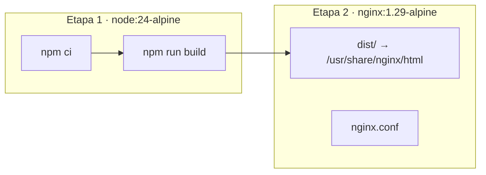
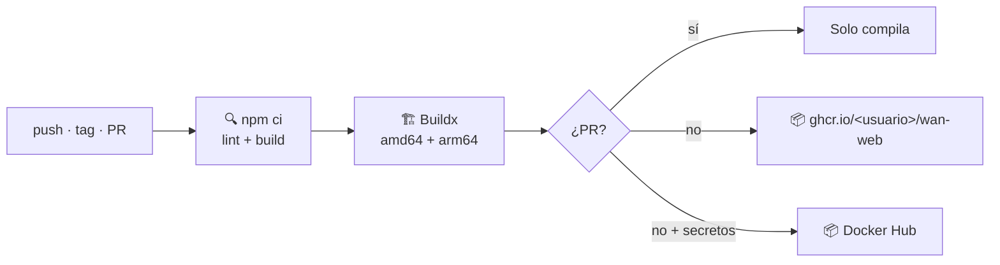

# 🐳 Despliegue

## Imagen



- La etapa de build corre en la arquitectura de quien compila (`--platform=$BUILDPLATFORM`): el resultado son archivos estáticos iguales para `amd64` y `arm64`.
- La imagen final es solo nginx con los archivos: unos pocos MB, sin Node.

## nginx

[`nginx.conf`](../nginx.conf) sirve el panel y hace de proxy a la API en el mismo origen:

| Ruta | Destino | Detalle |
|------|---------|---------|
| `/api/` | `http://api:8080` | `client_max_body_size 200m` (archivos de conocimiento y audio de grabaciones) |
| `/api/mcp` | `http://api:8080` | Sin buffer y con timeout de 1 h (streaming SSE) |
| `/hubs/` | `http://api:8080` | *Upgrade* a WebSocket y timeouts de 1 h (SignalR) |
| `/assets/` | archivos | Caché de 1 año (`immutable`): los nombres llevan hash |
| `/` | `index.html` | Fallback de SPA, `no-cache` |

**El servicio de la API debe llamarse `api`** en la red de Docker. Si no, monta tu propio `nginx.conf` en `/etc/nginx/conf.d/default.conf`.

## GitHub Actions

[`.github/workflows/docker.yml`](../.github/workflows/docker.yml):



| Evento | Tags |
|--------|------|
| push a `main` | `main`, `sha-<commit>` |
| tag `v1.2.3` | `1.2.3`, `1.2`, `1`, `latest` |
| pull request | ninguno |

- **GHCR** usa el `GITHUB_TOKEN`; no hay que configurar nada. El paquete nace privado: hazlo público en *Package settings* si quieres.
- **Docker Hub** es opcional: agrega los secretos `DOCKERHUB_USERNAME` y `DOCKERHUB_TOKEN` en el repositorio.
- La caché de capas de GitHub Actions (`type=gha`) acelera los builds siguientes.

Publicar una versión:

```bash
git tag v1.0.0 && git push origin v1.0.0
```

## Correr la imagen

```bash
docker run -d --name wan-web --network <red-de-la-api> -p 8080:80 \
  ghcr.io/<usuario>/wan-web:latest
```

El `docker-compose.yml` completo con la API y Postgres está en la [guía de despliegue del backend](../../backend/docs/despliegue.md#docker-compose-con-imágenes-publicadas).

## HTTPS

Pon un proxy con TLS (Caddy, Traefik o nginx con Let's Encrypt) delante del contenedor y reenvía todo a su puerto 80, incluidos los WebSocket. ElevenLabs necesita que la API sea accesible por `https`.
