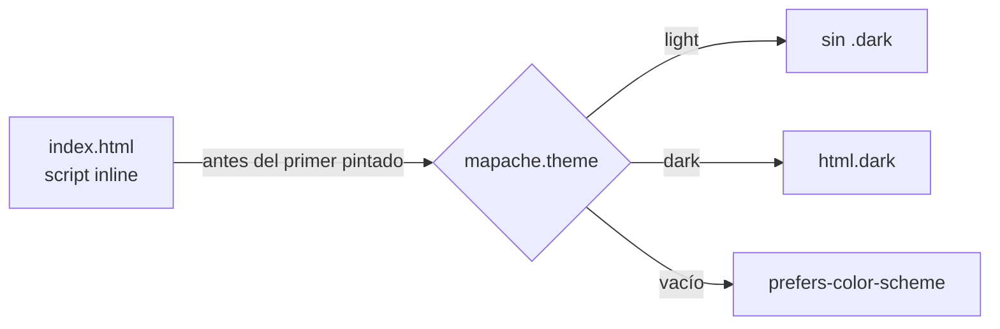

# 🎨 Estilos

## Principios

| | |
|---|---|
| 📱 **Mobile first** | Se diseña para ~360 px. Las clases sin prefijo son para el teléfono; `sm:`, `md:` y `lg:` solo agregan. |
| 🌗 **Claro y oscuro** | Todo color de fondo, texto y borde lleva su variante `dark:`. |
| ✋ **Táctil** | Áreas de toque de al menos 44×44 px (`min-h-11`, `size-11`). |
| 🧘 **Sobrio** | Blanco, grises `slate` y un acento. Tipografía con carácter en los títulos. |
| ⚡ **Movimiento con propósito** | Animaciones de 150 a 300 ms, respetando "reducir movimiento". |

## Tailwind CSS v4

- Plugin `@tailwindcss/vite`; **no hay `tailwind.config.js`**: la configuración vive en `src/index.css` (`@theme`, `@custom-variant`).
- Sin archivos `.css` por componente; solo clases de Tailwind.

## Tipografía

| Uso | Fuente |
|-----|--------|
| Texto e interfaz | **Inter** variable (`@fontsource-variable/inter`) |
| Títulos de página y login | **Instrument Serif** (`@fontsource/instrument-serif`) |

Las fuentes se empaquetan con la app: no se piden a Google Fonts en tiempo de ejecución.

## Tema claro / oscuro

- El modo oscuro es por clase: `.dark` en `<html>`.
- `lib/theme.ts` guarda la preferencia (`light`, `dark` o ninguna = sistema) en `localStorage` bajo `mapache.theme`.
- El script inline de `index.html` aplica el tema **antes** de que React cargue, así no hay parpadeo. Si cambia la clave de storage, cámbiala en los dos lugares.
- Con "sistema", el tema sigue los cambios del sistema operativo en vivo.

## Layout

| Pantalla | Navegación |
|----------|------------|
| Teléfono | Barra superior compacta + barra inferior (Inicio, Recados, Formularios, Más), respetando `env(safe-area-inset-*)` |
| `md:` y más | Sidebar fijo, colapsable a solo íconos (se recuerda en `localStorage`) |

- `min-h-dvh`, no `h-screen` (las barras del navegador móvil cambian el alto).
- Sin scroll horizontal: las tablas se vuelven tarjetas en el teléfono.

## Formularios de configuración

`FormSections` + `FormSection` dan el patrón de las pantallas de ajustes: título y descripción a la izquierda y campos a la derecha en escritorio; apilados en el teléfono.

## Motion

- Importa desde `motion/react`.
- Entrada de contenido, hojas de confirmación (`ConfirmSheet` con `AnimatePresence`) y feedback. Nada decorativo que retrase.
- `MotionConfig reducedMotion="user"` respeta la preferencia del sistema.

## Alertas

`<Toaster />` (átomo) configura react-hot-toast con los colores del tema. Cómo se disparan está en [datos.md](datos.md#alertas-con-react-hot-toast).
