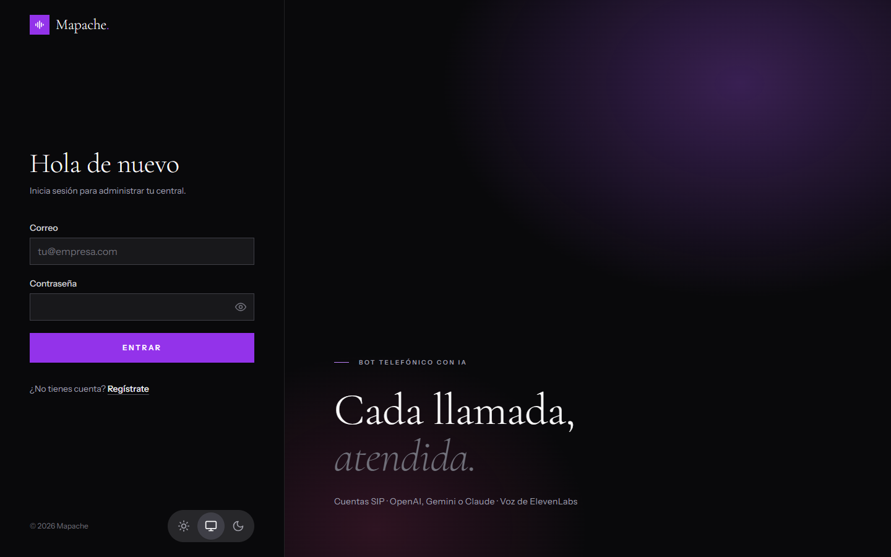
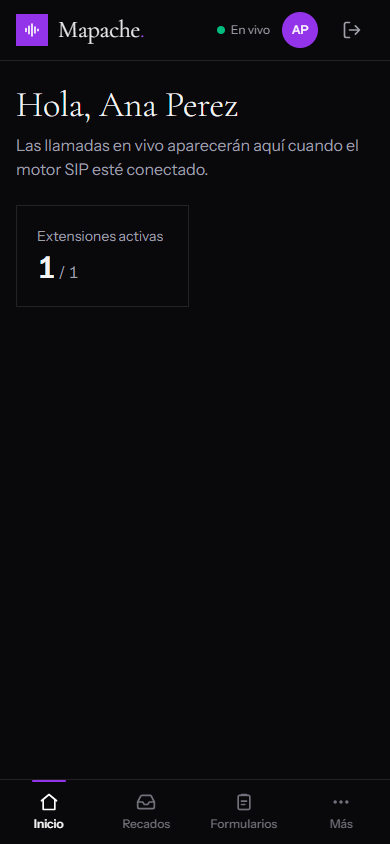
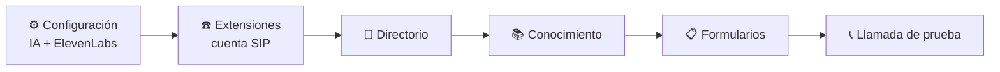
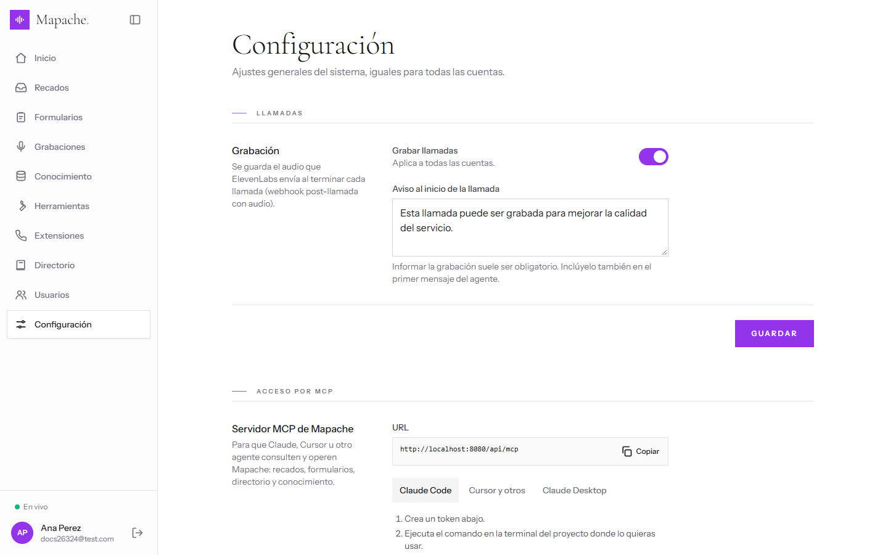
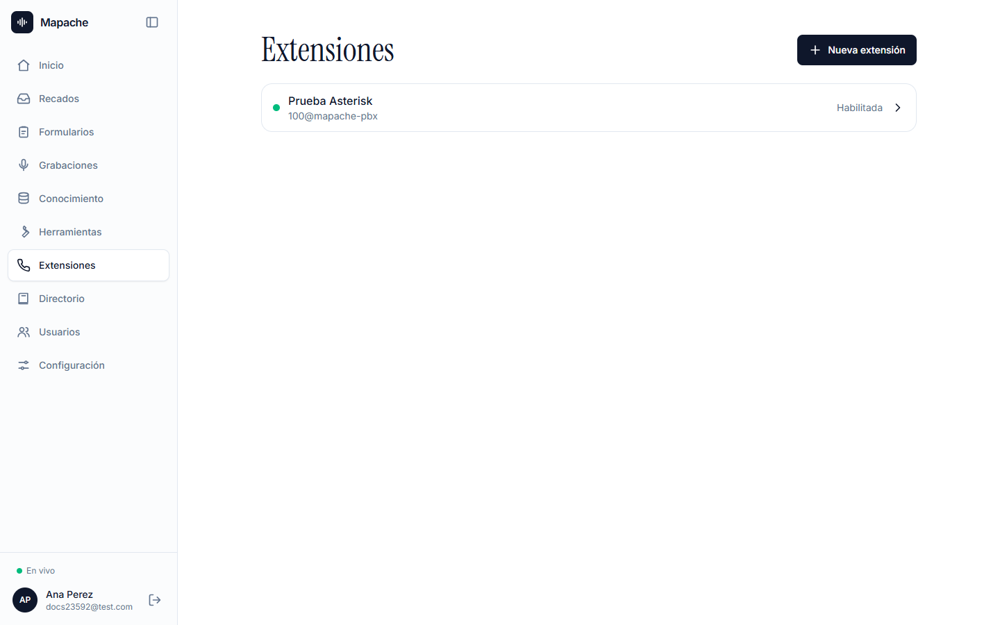
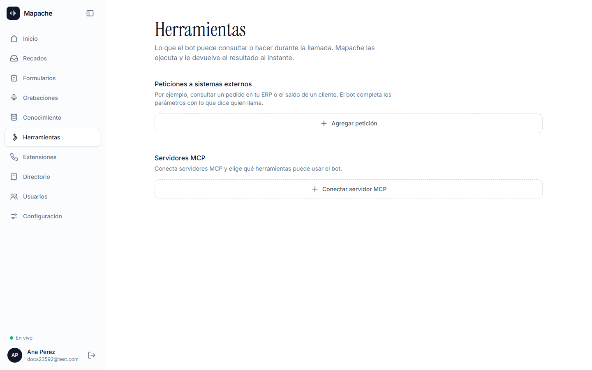

# 🧭 Guía de uso

Recorrido por cada pantalla del panel. Las marcadas con 🔒 solo las ven los administradores.

## Roles

| Rol | Puede |
|-----|-------|
| **Administrador** | Todo: extensiones, IA, voz, herramientas, formularios, usuarios y configuración. |
| **Operador** | Ver el panel, atender recados y respuestas de formularios, escuchar grabaciones. |

## Entrar

- El primer administrador se crea al arrancar, con `Auth__BootstrapAdmin__*`.
- **Regístrate** crea una cuenta de administrador. Ciérralo antes de exponer el panel a internet.
- El selector de abajo cambia el tema: claro, sistema u oscuro.

## Navegación

| Pantalla | Para qué |
|----------|----------|
| 🏠 **Inicio** | Resumen: extensiones activas y llamadas |
| ✉️ **Recados** | Mensajes que tomó el bot |
| 📋 **Formularios** | Qué datos pide el bot y las respuestas |
| 🎙️ **Grabaciones** | Audio de las llamadas |
| 📚 **Conocimiento** | Documentos que usa el bot |
| 🔌 **Herramientas** 🔒 | Consultas a sistemas externos |
| ☎️ **Extensiones** | Cuentas SIP |
| 📒 **Directorio** | A quién transferir |
| 👥 **Usuarios** 🔒 | Usuarios y roles |
| ⚙️ **Configuración** 🔒 | IA, voz, llamadas, correo y MCP |

En escritorio, el botón junto al logo colapsa el sidebar (se recuerda). En el teléfono, la barra inferior muestra Inicio, Recados y Formularios, y **Más** abre el resto.

El punto verde **En vivo** indica que el panel recibe eventos del servidor. Si se corta, reconecta solo y vuelve a pedir los datos.

## Puesta en marcha recomendada

## 📞 Teléfono

El botón del teléfono está abajo del sidebar, junto a tu perfil (en el celular, arriba junto al avatar).

- **Marcador:** escribe el número o usa el teclado (mantén el **0** para escribir `+`) y elige abajo la extensión desde la que sale la llamada; el punto indica si está registrada.
- **Recientes y Contactos:** un clic en una llamada o en una persona del directorio pone el número en el marcador.
- **En llamada:** cronómetro, silenciar, teclado para tonos (menús de la central) y colgar.
- La llamada **sigue al cambiar de página**: abajo del sidebar aparece la barra "En llamada" con el número y el botón para colgar.

El navegador pide permiso para el micrófono la primera vez. Fuera de `localhost` el panel debe servirse por HTTPS.

## ⚙️ Configuración 🔒

| Sección | Qué se configura |
|---------|------------------|
| **General** | URL pública de Mapache, que se usa en las URLs para ElevenLabs y MCP. También se puede fijar con `App__PublicUrl` en el `.env`; la del panel tiene prioridad |
| **Llamadas** | Grabar llamadas y el aviso de grabación que dice el bot |
| **IA** | Proveedor activo (OpenAI, Gemini o Claude), API key y modelo de cada uno, instrucciones del bot y la URL del Custom LLM para pegar en ElevenLabs |
| **ElevenLabs** | API key y ID del agente de voz |
| **Correo** | Servidor SMTP para las acciones de formularios |
| **Acceso por MCP** | Tokens para que agentes externos operen Mapache |

Las API keys y contraseñas se guardan cifradas y nunca se vuelven a mostrar: el campo indica si hay una cargada. Déjalo vacío para conservarla.

### Acceso por MCP

1. Escribe un nombre para el token ("Claude de Ana").
2. Deja **Acceso total** o apágalo y activa solo las herramientas que necesita, agrupadas en *Consultar* y *Modificar datos*.
3. **Crear token.** El valor se muestra **una sola vez**: cópialo.
4. Elige tu cliente en las pestañas (Claude Code, Cursor y otros, Claude Desktop) y copia el comando, que ya trae la URL y el token.

En la lista de tokens puedes cambiar los permisos de cada uno o revocarlo.

## ☎️ Extensiones

Cada extensión es una cuenta SIP, como las de MicroSIP. El punto verde indica que está habilitada y el gris que está deshabilitada.

El estado del registro (registrada, registrando o falló, con el motivo, por ejemplo `401 Unauthorized`) ya lo publica la API en `/api/extensions/status` y por SignalR. Mostrarlo en el panel está pendiente, junto con el nuevo Inicio.

**Nueva extensión:**

| Sección | Campos |
|---------|--------|
| Cuenta | Nombre, servidor SIP, usuario, contraseña, dominio, usuario de autenticación, nombre para mostrar |
| Servidores | Servidor secundario (si falla el principal) y proxy de salida |
| Red | Transporte UDP/TCP/TLS, puerto local, IP pública, STUN, keepalive, reescritura de IP |
| Registro | Expiración y reintento |
| Audio | Códecs y modo DTMF |
| Llamadas | Quién contesta (bot, bot con paso a persona o persona) y llamadas simultáneas |

Al guardar, el motor SIP registra la cuenta en segundos, sin reiniciar nada.

**Horario de atención** (en la misma pantalla): activa el horario y marca los días, la hora de apertura y cierre y, si hay, el descanso (por ejemplo, el almuerzo). **Copiar a todos** repite un día en los demás. Fuera de horario o en el descanso, el bot no transfiere llamadas: dice el **mensaje de fuera de horario** (o el del descanso) y ofrece tomar un recado.

## 📒 Directorio

Personas y áreas a las que el bot puede transferir: nombre, área, destino (extensión, número o URI SIP) y **cuándo transferir** ("consultas de facturación", "reclamos"). El bot lo recibe en cada llamada.

## 📚 Conocimiento

1. **Nueva base:** por ejemplo "Políticas" o "Precios 2026".
2. **Subir archivos:** PDF, Word, TXT, Markdown, CSV o HTML.
3. **Probar búsqueda:** escribe una pregunta como la haría un cliente y mira qué fragmentos recibiría el bot.

Desactivar una base la saca del bot sin borrarla.

## 🔌 Herramientas 🔒

- **Peticiones a sistemas externos:** el bot consulta tu ERP o CRM. Defines la URL con `{{parametros}}`, los headers (cifrados) y qué datos debe pedir. **Probar** ejecuta la petición con valores de ejemplo.
- **Servidores MCP:** pega la URL de un servidor MCP. Mapache lee sus herramientas y eliges con toggles cuáles puede usar el bot.

## 📣 Campañas

El bot llama a una lista de contactos con un guion.

1. **Nueva campaña:** extensión, guion (con `{{nombre}}` y las columnas del CSV), frase inicial, resultados posibles, simultáneas y reintentos.
2. **Importar CSV:** archivo o datos pegados de Excel / Google Sheets, con una columna de teléfono.
3. **Iniciar:** el bot empieza a llamar en unos segundos. Se puede **pausar** y **reanudar**.
4. En el detalle se ve el avance, cuántos contestaron, los resultados que registró el bot y sus notas por contacto. **Volver a llamar** pone un contacto otra vez en la cola.

## 📋 Formularios

- **Nuevo formulario:** nombre, instrucciones para el bot y campos (texto, número, teléfono, correo, fecha, sí/no, opciones).
- **Crear con IA:** describe el formulario y la IA arma un borrador para revisar.
- **Respuestas:** cada llamada que completa el formulario, con sus datos. Se marcan como revisadas o se vuelven a dejar como nuevas.
- **Acciones:** qué pasa con cada respuesta nueva: webhook, Teams, Google Chat, Slack o correo. Cada una tiene **Probar** y muestra si falló, con opción de reintentar.

## ✉️ Recados

Los mensajes que el bot toma para quien no puede atender: para quién, de quién, número de devolución, el recado y si es urgente. Filtra por **Pendientes**, **Resueltos** o **Todos** y cambia el estado con un clic. Los nuevos aparecen solos.

## 🎙️ Grabaciones

Con **Grabar llamadas** activo, cada conversación aparece aquí para escucharla y adelantarla. Un administrador puede borrarlas.

## 👥 Usuarios 🔒

- **Nuevo usuario:** nombre, correo, contraseña inicial y rol.
- Cambia el rol desde la lista.
- **Contraseña** pone una nueva sin pedir la anterior.
- **Eliminar** pide confirmación.

No puedes eliminarte a ti mismo ni dejar el sistema sin administradores.

## 👤 Perfil

Desde tu avatar: cambia tu nombre, tu contraseña (pide la actual) y el tema.
