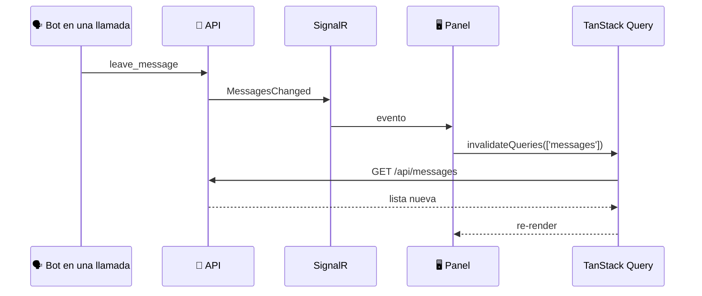

# ⚡ Tiempo real

El panel mantiene una conexión SignalR con la API (`/hubs/events`) mientras hay sesión. Los eventos no traen los datos: **invalidan** las queries afectadas y TanStack Query las vuelve a pedir. Así hay una sola fuente de verdad, la API.

## Eventos

| Evento | Qué invalida |
|--------|--------------|
| `ExtensionsChanged` | La lista de extensiones. Los detalles solo se marcan como viejos, para no pisar un formulario abierto ni pedir uno recién borrado. |
| `MessagesChanged` | `['messages']` |
| `FormSubmissionsChanged` | `['forms']` (lista, respuestas y acciones) |
| `RecordingsChanged` | `['recordings']` |

El backend también emite `ExtensionStatusChanged`, `CallsChanged` y `CallTranscript` (estado SIP y llamadas en vivo). El panel todavía no los escucha; son la base del nuevo Inicio.

## Conexión (`hooks/useRealtime.ts`)

- El JWT viaja en `accessTokenFactory` (SignalR lo pone en el query string porque los WebSocket no admiten headers).
- Reconexión automática. Al reconectar se invalida **todo**, porque pudo haber cambios mientras no había conexión.
- El estado (`connecting`, `connected`, `reconnecting`, `disconnected`) se muestra con `RealtimeIndicator`: el punto **En vivo** del sidebar.
- `useRealtime` se usa en `AppTemplate`, así la conexión vive mientras el usuario está dentro del panel.

## Agregar un evento

1. En el backend: agrega el método a `IEventsClient` y emítelo con `IHubContext<EventsHub, IEventsClient>`.
2. En `useRealtime.ts`: `connection.on('MiEvento', () => queryClient.invalidateQueries({ queryKey: keys.miDominio }))`.

## Desarrollo y proxy

- En `npm run dev`, Vite hace proxy de `/hubs` con `ws: true`.
- En Docker, nginx hace el *upgrade* a WebSocket en `/hubs/` con timeouts de una hora.
